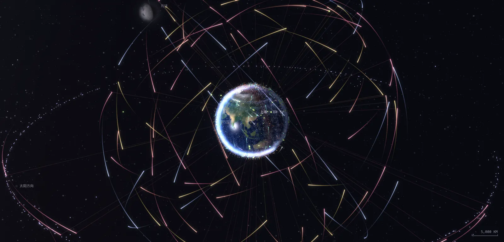

# Orbit · Live Satellite Tracker

English · [中文](README.zh-CN.md)

**[orbit.ignat.ai](https://orbit.ignat.ai)** — see where thousands of satellites around Earth are right now, in your browser.



- **Live sky**: Starlink, the GNSS constellations (GPS / BeiDou / Galileo / GLONASS), Iridium and more, lit by the real Sun and Moon. Zoom out to cislunar space and the spacecraft at Sun–Earth L1/L2.
- **Tools**: search satellites by name or NORAD ID, see a precise orbit (SGP4), and predict visible passes over your location. Your location is computed in the browser and never uploaded.
- **Object backgrounds**: select or search satellites and spacecraft for bilingual mission introductions, affiliations and verified launch information.
- **Learn**: interactive guides to seven common orbit types and the six orbital elements.
- **Mission replays**: Apollo, Artemis, Chang'e, Voyager, Cassini, Tianwen-1 and more, replayed along their real (or reconstructed) trajectories.

A static site built with React, [ogl](https://github.com/oframe/ogl) (WebGL 2) and [satellite.js](https://github.com/shashwatak/satellite-js), hosted on GitHub Pages. GitHub Actions refreshes the ephemerides twice a day.

## Run locally

Requires Node.js 24 (see `.node-version`) and pnpm.

```bash
pnpm install --frozen-lockfile
pnpm data:fetch   # fetch the latest ephemerides into public/data/
pnpm dev          # open http://127.0.0.1:3001/
```

## Data and assets

- Satellite elements: [CelesTrak](https://celestrak.org)
- Spacecraft and mission ephemerides: [NASA/JPL Horizons](https://ssd.jpl.nasa.gov/horizons/)
- Land boundaries: [Natural Earth](https://www.naturalearthdata.com) (via [world-atlas](https://github.com/topojson/world-atlas))
- Night lights: [NASA Earth Observatory · Black Marble 2016](https://earthobservatory.nasa.gov/features/NightLights)

Sources and processing for each asset are described in the README files under `public/`. Missions marked "reconstructed" are illustrative trajectories derived from published figures, not measured data.

## Maintain object backgrounds

`src/lib/object-profiles.ts` is an authored catalogue loaded on selection. No script or scheduled workflow updates it.

- `GROUP_PROFILES` and `FAMILIES` provide group and identifiable-family backgrounds; `SATELLITE_PROFILES` overrides them by NORAD ID. `SPACECRAFT_PROFILES` covers the five deep-space and lunar spacecraft.
- `LAUNCH_PROFILES` supplies verified batch dates only when both the catalogue group and international designator match. Add batches manually with a launch source; never apply them to unrelated payloads or fragments.
- Supply English and Chinese text and source links. `launch` is the individual object's verified UTC date (`YYYY-MM-DD`), never the family's first launch. Store fragmentation events separately in `event`.
- Undocumented fields are labelled as such. A designator year can refer to a parent launch, so it is not presented as a released object's launch or separation date.

The existing ephemeris workflow continues to update orbital data only.
